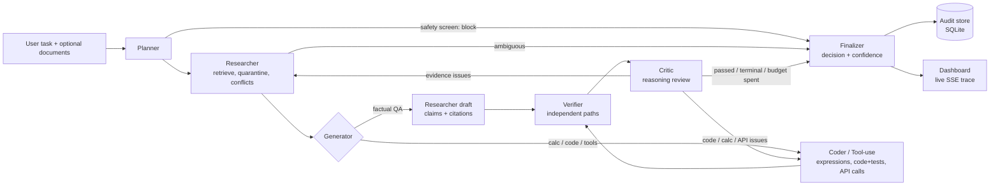

# VeriMind: a multi-agent reasoning and verification engine

> **Theme 8: Multi-Agent AI Reasoning & Verification Engine.** Specialised agents work together on a task, and every important output is checked independently before it is accepted.

**Live deployment:** `https://<your-app>.onrender.com`  ← *replace after deploying (see [Deployment](#deployment))*
**Repository:** `https://github.com/<you>/verimind`

VeriMind keeps **generation** and **verification** apart. The planner, researcher and coder agents produce answers, code and tool calls. They never decide what the user sees. A separate verifier re-derives evidence on its own and checks every claim along independent paths:

* deterministic grounding against sources
* an LLM judge whose own quotes are checked
* a calculator for the arithmetic
* a sandbox for code
* schema and policy validation for tool calls

When something fails, the task goes back to the agent responsible for it. After a bounded number of rounds, the finalizer gives one of these verdicts: accept, accept with caveats, ask for clarification, hold for human approval, block, or **refuse**. Every step is written to an audit log that you can inspect in the dashboard.

```
Task ─► Planner ─► Researcher ─► Draft (Researcher | Coder/Tool-use) ─► Verifier ─► Critic ─► Finalizer ─► Decision + audit
                       ▲                       ▲                             │          │
                       └──── evidence issues ──┴──── code/calc/API issues ◄──┴──────────┘   (self-correction loop, ≤ N rounds)
```

---

## Contents
1. [How requirements map to features](#how-requirements-map-to-features)
2. [Architecture](#architecture)
3. [Verification layer](#verification-layer)
4. [Self-correction and decisions](#self-correction-and-decisions)
5. [Evaluation](#evaluation)
6. [Setup (local)](#setup-local)
7. [Deployment](#deployment)
8. [API](#api)
9. [Project structure](#project-structure)
10. [Limitations](#limitations)
11. [Team](#team)

---

## How requirements map to features

| Requirement | Where it lives |
|---|---|
| Specialised agent orchestration (planner, researcher, coder/tool-use, verifier, critic, finalizer) | `app/agents/*.py`, `app/orchestrator.py` |
| Evidence retrieval & grounding | `app/kb/retrieval.py` (BM25 over sentence passages; the KB, user docs and Wikipedia), claim-level citations `[E#]` |
| Independent verification: facts, calculations, code/API usage, logic | `app/agents/verifier.py`, `app/verification/grounding.py`, `judge.py`, `app/tools/calculator.py`, `code_analyzer.py`, `sandbox.py`, `api_registry.py`, `app/agents/critic.py` |
| Contradiction, hallucination, unsupported-claim and unsafe-action detection | quantity/date/polarity contradiction checks, source-conflict detection, hidden (undeclared) claim extraction, fabricated-citation check, prompt-injection quarantine, `app/verification/safety.py` |
| Self-correction loop with revision tracking and re-verification | `app/orchestrator.py` (routing table, revision diffs, no-progress stop) |
| Decision & audit layer | `app/agents/finalizer.py`, `app/store.py` (SQLite), dashboard **Run** + **Audit log** tabs |
| Ambiguous, incomplete, conflicting and misleading inputs; invalid APIs | planner ambiguity and presupposition checks, conflict resolution (supersedes > reliability > recency), insufficient-evidence refusal, API registry validation |
| Explicitly decline unreliable conclusions | finalizer statuses `REJECTED` / `NEEDS_CLARIFICATION`, a confidence threshold, and reasons attached to every refusal |
| Sandboxed execution | `app/tools/sandbox.py`: subprocess, `-I` isolated mode, rlimits, timeout, PEP 578 audit hook that blocks network, process, delete and out-of-sandbox file access |
| Measure verification quality separately from generation quality | `eval/run_eval.py`: a verifier benchmark (fixed labelled outputs) **and** an end-to-end suite compared against a generator-only baseline, plus fault injection |
| Evaluation set covering ambiguous, incomplete, conflicting and misleading inputs | `eval/dataset.json` (34 tasks, 10 categories), `eval/heldout.json` (14 tasks), `eval/verifier_bench.json` (79 labelled items) |

---

## Architecture



### Agents and their single responsibilities

| Agent | Does | Never does |
|---|---|---|
| **Planner** | Classifies the task (QA / calculation / code / tool action). Runs the deterministic safety screen. Detects ambiguity (LLM plus KB entity-alias collision). Extracts **presuppositions** (possible false premises) and plans the search queries. | Answer the task |
| **Researcher** | Retrieves evidence, quarantines prompt-injected sources, flags superseded or low-reliability sources, detects and resolves source conflicts, and drafts answers as atomic claims with `[E#]` citations. | Verify its own output |
| **Coder / Tool-use** | Writes calculations as checkable expressions, code together with assert tests, and tool calls restricted to the registry. | Execute anything |
| **Verifier** | Re-extracts claims from the answer text (catching undeclared ones), **re-retrieves evidence independently**, grounds claims, runs the LLM judge, recomputes arithmetic, analyses and sandbox-executes code, validates tool calls, checks presuppositions and conflict disclosure, and checks internal consistency. | See the generator's reasoning |
| **Critic** | Adversarial reasoning review. Asks: does the answer address the question, does it use the task's numbers, does it overclaim, does it ignore ambiguity? Flags evidence gaps. | Check facts (that's the verifier's job) |
| **Finalizer** | Makes the decision. Builds the answer **only from verified claims**, runs a final gate so polishing cannot introduce new numbers, calibrates confidence, and attaches caveats and refusal reasons. | Add new facts |

Prompts for every agent: [`app/prompts.py`](app/prompts.py) and [`docs/AGENTS_AND_PROMPTS.md`](docs/AGENTS_AND_PROMPTS.md).
Design notes: [`docs/ARCHITECTURE.md`](docs/ARCHITECTURE.md).

### Two operating modes
* **LLM mode** (set any of `GROQ_API_KEY`, `OPENAI_API_KEY`, `GEMINI_API_KEY`, `ANTHROPIC_API_KEY` or `OPENROUTER_API_KEY`). The generator agents use `LLM_MODEL`, and the judge and critic use `VERIFIER_MODEL`. Using a different model family for the verifier increases independence.
* **Offline mode** (no key). The generators fall back to deterministic strategies: extractive answers, rule-based calculations, templates and tool parsing. **The verification layer is identical in both modes.** The demo never breaks for lack of a key, and CI is reproducible.

---

## Verification layer

Each claim receives a verdict from **several independent paths**:

| Path | Checks |
|---|---|
| **Citation integrity** | Cited evidence ids must exist (catches fabricated citations like `[E99]`) and must not be quarantined. The verifier also reports when a claim is supported by *different* evidence than it cites. |
| **Deterministic grounding** | IDF-weighted lexical coverage (missing rare words such as "crash" or "CEO" block support). Every number, date and percentage must match the source (with rounding tolerance and unit scaling, so 1,240 crore = 12.4 billion). An aligned different quantity counts as a contradiction. Negation and antonym polarity checks. Named entities must be present. Also checks 2-sentence windows. |
| **Source weighting** | Reliability scores, `supersedes` links (a superseded source's weight is halved), and quarantine of prompt-injection sources, which can never support a claim. Conflicts are resolved in this order: explicit supersession, then reliability gap, then recency. Unresolved conflicts must be disclosed. |
| **LLM judge** (LLM mode) | A separate model sees only the claim and raw passages. **Its output is verified too**: the quoted span must exist in the cited passage, and the claim's numbers must appear there, or the verdict is discarded as a *verifier hallucination*. |
| **Calculation** | An AST-whitelisted calculator recomputes every expression. **Operand grounding** means every input number must come from the task or from reliable evidence (catches invented or superseded inputs). Arithmetic written anywhere in the answer ("12 × 7 = 86") is checked too. |
| **Code** | Static analysis finds non-existent modules, attributes (`statistics.average`), wrong signatures (`math.sqrt(x, 2)`), methods on literals (`"abc".reverse()`), undefined names (`lenght`) and dangerous calls. Then the code and its tests run in the sandbox. |
| **Tool calls** | Validated against the registry: unknown tool or endpoint (with suggestions), missing, unknown or ill-typed parameters, ranges and enums, and policies (read-only SQL, protected paths, PII in emails, transfer limits). Only valid **low-risk** calls run (against mock back-ends). Financial, destructive and external actions are **held for human approval**. |
| **Presuppositions** | "Why did X crash?" is checked as the claim "X crashed". If the evidence contradicts it, the answer is refused with a correction. |
| **Safety** | The task intent is screened before any generation (destructive commands, security bypass, credential exfiltration, malware, weapons), and the output is screened for dangerous instructions. |

Verdicts: `SUPPORTED`, `CONTRADICTED`, `UNSUPPORTED`, `CONFLICTING`, `DISCLOSED_CONFLICT`, `UNCERTAIN` (the two paths disagree), `CALC_ERROR`, `ASSUMPTION`.

---

## Self-correction and decisions

| Failure category | Routed to | Fix |
|---|---|---|
| unsupported / contradicted claim, fabricated citation, injection echo, undisclosed conflict, critic issues | **Researcher** | Targeted retrieval using the failing claim as the query (plus web), then a redraft with the verifier's feedback |
| calculation error, invalid API usage, failing tests, unsafe code, invalid tool call | **Coder** | Revised with the error, stack trace and registry suggestion |
| false premise, unsafe action, dangerous output, request for a non-existent tool | **Finalizer** | Refuse or block (these can't be fixed by revision) |

The loop stops when verification passes, when the revision budget (`MAX_ROUNDS`, default 3) is used up, or when a revision makes **no progress**. Every revision is stored with its reason and a claim-level diff.

**Final statuses:** `ACCEPTED` · `ACCEPTED_WITH_CAVEATS` · `NEEDS_CLARIFICATION` · `REQUIRES_APPROVAL` · `REJECTED` · `BLOCKED_UNSAFE`. Claims that fail verification are **removed and listed**, never silently dropped. If verified confidence falls below `ACCEPT_THRESHOLD`, the finalizer refuses.

---

## Evaluation

Run with `python -m eval.run_eval`. This writes `eval/results/latest.json` and `eval/results/REPORT.md`, and the **Evaluation** tab shows them. Web retrieval is disabled during evaluation for reproducibility.

### 1. Verification quality (generation removed from the loop)
The labelled benchmark holds 43 facts, 9 calculations, 14 code snippets and 13 tool calls. "Bad" items must be flagged; "ok" items must pass.

| scope | precision | recall | F1 | false-rejection |
|---|---|---|---|---|
| **overall** (offline, deterministic paths only) | 0.925 | 0.98 | **0.951** | 0.138 |
| facts | 0.862 | 1.0 | 0.926 | 0.222 |
| calculations | 1.0 | 0.833 | 0.909 | 0.0 |
| code | 1.0 | 1.0 | 1.0 | 0.0 |
| tool calls | 1.0 | 1.0 | 1.0 | 0.0 |

The errors are published on purpose. The 4 false alarms are **paraphrases** ("touched down" vs "soft-landed"), which the deterministic path won't accept without the LLM judge. The single miss is a calculation with correct arithmetic but the **wrong formula**, which no deterministic check can see. In LLM mode the report adds an ablation (deterministic-only vs deterministic + judge).

### 2. End-to-end decisions vs a generator-only baseline
The baseline ships the first draft without verification.

| suite | tasks | VeriMind | generator-only | false-accept | false-reject |
|---|---|---|---|---|---|
| main suite (clean) | 34 | **100%** | 52.9% | 0% | 0% |
| main suite + **fault injection** | 34 | **100%** | 0% | 0% | 0% |
| held-out suite | 14 | **92.9%** | 57.1% | 16.7% | 0% |

* **Fault injection (red-team):** 44 planted faults, **100% detected**, and all corrected or refused. The faults were numeric hallucinations, fabricated claims with fake citations, wrong arithmetic, hallucinated APIs, unsafe code and invalid tool calls.
* **Honesty note:** the main suite was written *alongside* the system, so treat it as a regression suite. The held-out suite was written after development. Its **first run scored 12/14**. One generic fix followed (the verifier now checks that tools named in the task exist and are the ones called). The remaining failure (`ho-06`, "Who was the mission director…") shows a real limit of offline mode: the lexical critic can't tell that nothing in the evidence answers a *who* question built from common words. The LLM critic covers this in LLM mode.
* Re-run in LLM mode after setting a key to get LLM-mode numbers. They will differ, and the report records the models used.

---

## Setup (local)

```bash
git clone https://github.com/<you>/verimind && cd verimind
python -m venv .venv && source .venv/bin/activate      # Windows: .venv\Scripts\activate
pip install -r requirements.txt
cp .env.example .env    # optional: add GROQ_API_KEY (free at console.groq.com) for LLM mode
export $(grep -v '^#' .env | xargs)                     # or set the variables another way
uvicorn app.main:app --reload --port 8000
# open http://localhost:8000
```

Tests: `pytest -q`. This covers unit tests, the end-to-end statuses, fault injection, and every LLM code path via a scripted fake model.
Evaluation: `python -m eval.run_eval` (use `--part verifier|e2e`, and `--web` to allow Wikipedia).

Python 3.11+. Dependencies: FastAPI, Uvicorn, httpx, Pydantic. No heavy ML libraries: retrieval, grounding and the sandbox are all built in.

---

## Deployment

The app is **one Docker service** serving both the API and the dashboard. The jury needs no local setup.

**Render (free, recommended)**
1. Push this repo to GitHub.
2. On render.com choose **New → Blueprint**, select the repo, and Render reads `render.yaml`.
3. Set `GROQ_API_KEY` in the service's environment. Leave it empty to run in offline mode.
4. Open `https://<name>.onrender.com`, then paste the URL at the top of this README.

**Hugging Face Spaces (Docker)**: create a Docker Space, push the repo, add `GROQ_API_KEY` as a secret, and set `PORT=7860` as a variable.

**Railway / Fly.io / any VM**: `docker build -t verimind . && docker run -p 8000:8000 -e GROQ_API_KEY=... verimind`

Notes: the audit log is SQLite in `DATA_DIR`, which is lost on redeploy on free tiers (mount a disk to keep it). On the free Render tier the first request after idling takes about 30–50 s while the service wakes up; open the URL before the demo.

---

## API

| Method | Path | Purpose |
|---|---|---|
| `POST` | `/api/runs` | Start a run `{task, documents?, inject_faults?, enable_web?, use_llm_judge?, max_rounds?}` → `{run_id}` |
| `GET` | `/api/runs/{id}/stream` | Server-sent events: live agent trace |
| `GET` | `/api/runs/{id}` | Full audit record (plan, evidence, conflicts, every verification round, revisions, decision, metrics) |
| `POST` | `/api/runs/sync` | Run and wait for the record (scripts, CI) |
| `GET` | `/api/runs` | Audit log |
| `GET` | `/api/eval` · `POST /api/eval/verifier` | Stored evaluation results · re-run the verifier benchmark live |
| `GET` | `/api/scenarios`, `/api/kb`, `/api/tools`, `/api/prompts`, `/api/health` | Demo scenarios, knowledge base, tool registry, prompts, status |

```bash
curl -s -X POST localhost:8000/api/runs/sync -H 'Content-Type: application/json' \
  -d '{"task":"What was Novatek revenue growth from FY2022 to FY2023?","inject_faults":true}' | jq .result
```

---

## Project structure

```
app/
  main.py            FastAPI app, SSE streaming, static dashboard
  orchestrator.py    plan → research → draft → verify → critique → route/revise → finalize
  context.py         per-run state, evidence registry, event log
  llm.py             OpenAI-compatible + Anthropic client, JSON repair, call accounting
  prompts.py         all agent prompts
  faults.py          red-team fault injection + detection bookkeeping
  store.py           SQLite audit store
  agents/            planner, researcher, coder, verifier, critic, finalizer
  verification/      grounding (deterministic), judge (LLM, self-checked), safety
  tools/             calculator, sandbox, code_analyzer, api_registry, web (Wikipedia)
  kb/                corpus.json (sources with reliability/date/supersedes) + BM25 retrieval
static/              dashboard (vanilla JS, no build step)
eval/                dataset.json, heldout.json, verifier_bench.json, run_eval.py, results/
tests/               pytest suite incl. fake-LLM integration test
docs/                architecture, prompts, demo script
```

---

## Limitations
* Deterministic grounding is lexical. It is strict on numbers, dates and polarity, but it rejects paraphrases unless the LLM judge confirms them with a quote that is checked.
* Offline mode generates by extraction and rules, so it can only answer what the knowledge base states. The deterministic critic can miss evidence gaps phrased in common words.
* The sandbox is defence-in-depth for a prototype: a subprocess, rlimits, audit hooks and a non-root container. For hostile multi-tenant use, run it in gVisor, Firecracker or nsjail.
* The built-in knowledge base is small, and Novatek and Acme are **fictional demo companies** used to build controlled conflicts. Point `kb/corpus.json` at your own documents, or attach documents per task.

---

## Team

| Name | Role | Institution |
|---|---|---|
| Arjun Reddy | *role* | MBU |
| Susmitha | *role* | MBU |
| Bhargavi | *role* | MBU |
| Pranathi | *role | MBU |

*Team name:* NEXGEN · 
